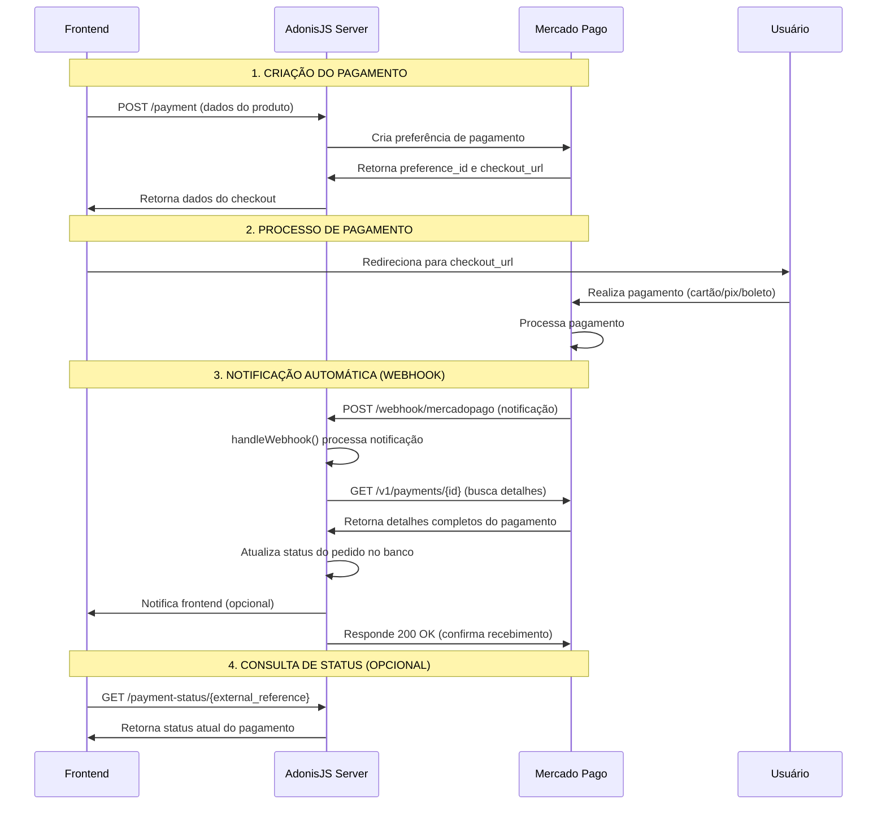

# 🔄 Fluxo do Webhook - Mercado Pago

## Sequência de Eventos



## Timing Detalhado

### ⚡ Pagamentos Instantâneos (Cartão/PIX)
```
15:30:00 - Usuário clica "Pagar"
15:30:02 - Mercado Pago processa
15:30:03 - WEBHOOK DISPARADO → seu servidor
15:30:03 - handleWebhook() executa
15:30:04 - Status atualizado no seu sistema
```

### 🕐 Pagamentos Demorados (Boleto)
```
Segunda 15:30 - Usuário gera boleto
Terça 10:45 - Usuário paga no banco
Terça 14:20 - Compensação bancária
Terça 14:21 - WEBHOOK DISPARADO → seu servidor
```

## Tipos de Notificação Recebidos

### 1. Notificação de Pagamento Aprovado
```json
{
  "id": 12345,
  "live_mode": false,
  "type": "payment",
  "date_created": "2024-01-15T10:30:00Z",
  "application_id": 123456789,
  "user_id": 987654321,
  "version": 1,
  "api_version": "v1",
  "action": "payment.updated",
  "data": {
    "id": "67890"
  }
}
```

### 2. O que seu webhook faz ao receber:
1. ✅ Valida se é uma notificação válida
2. 🔍 Extrai o `payment_id` da notificação
3. 📞 Consulta detalhes completos na API do MP
4. 🔄 Atualiza status no seu banco de dados
5. 📱 Notifica o frontend (se implementado)
6. ✅ Responde 200 OK para confirmar recebimento

## Configuração do Webhook

Para o webhook funcionar em produção, você precisa:

### No Painel do Mercado Pago:
1. Acesse: https://www.mercadopago.com.br/developers/panel/app
2. Vá em "Webhooks"
3. Configure a URL: `https://seudominio.com/webhook/mercadopago`
4. Selecione eventos: `Pagamentos`

### No seu código (já implementado):
```typescript
// Rota do webhook (sem CORS para receber do MP)
router.post('/webhook/mercadopago', async (ctx) => {
  const controller = new PaymentsController()
  return controller.handleWebhook(ctx)
})
```
